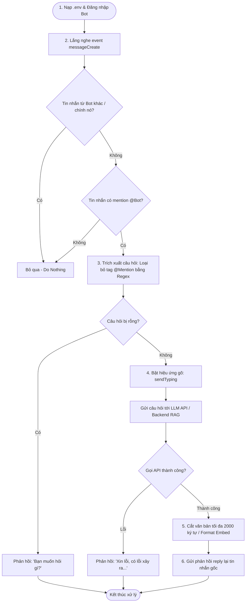
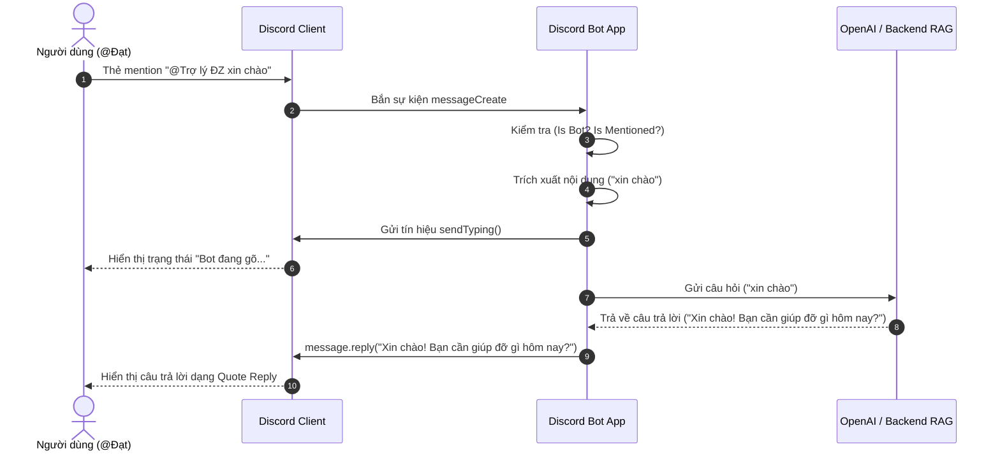

# Discord AI Bot — Luồng hoạt động (Workflow Documentation)

Tài liệu này mô tả chi tiết luồng hoạt động (workflow) của Discord AI Bot dựa trên hình ảnh thực tế tương tác trong server Discord và source code ứng dụng.

---

## 1. Sơ đồ luồng (Flowchart & Sequence Diagrams)

### 1.1 Sơ đồ tiến trình (Flowchart)

### 1.2 Sơ đồ trình tự (Sequence Diagram)

---

## 2. Chi tiết các bước xử lý (Detailed Phase Description)

| Bước | Tên giai đoạn | Mô tả kỹ thuật | Code tương ứng |
|---|---|---|---|
| **1** | **Khởi tạo (Bootstrap)** | Nạp token từ `.env`, khởi tạo `Client` với Intents: `Guilds`, `GuildMessages`, `MessageContent`. Bot đăng nhập và sẵn sàng nhận tin. | [`index.js:1-17`](file:///c:/VinAI/lab/Hackathon/K3-TEAM_B1-E402/discord-ai-bot/index.js#L1-L17) |
| **2** | **Lắng nghe & Lọc (Filter)** | Lắng nghe event `messageCreate`. Lọc bỏ tin nhắn do Bot tạo (`message.author.bot`) và bỏ qua tin nhắn không mention Bot (`!message.mentions.has(...)`). | [`index.js:19-21`](file:///c:/VinAI/lab/Hackathon/K3-TEAM_B1-E402/discord-ai-bot/index.js#L19-L21) |
| **3** | **Tiền xử lý (Sanitize)** | Dùng Regex `/<@!?\d+>/g` xóa phần mention `@Trợ lý ĐZ`, trim khoảng trắng thừa để lấy nội dung câu hỏi thực sự. | [`index.js:23-24`](file:///c:/VinAI/lab/Hackathon/K3-TEAM_B1-E402/discord-ai-bot/index.js#L23-L24) |
| **4** | **Xử lý AI & Trạng thái UX** | Kích hoạt hiệu ứng đang gõ `sendTyping()` trên kênh chat, gửi payload sang OpenAI (`gpt-4o-mini`) hoặc FastAPI backend. | [`index.js:27-33`](file:///c:/VinAI/lab/Hackathon/K3-TEAM_B1-E402/discord-ai-bot/index.js#L27-L33) |
| **5** | **Phản hồi (Response)** | Nhận kết quả từ AI, cắt giảm tối đa 2000 ký tự (giới hạn Discord), sử dụng `message.reply()` để trả lời kèm trích dẫn tin nhắn gốc. | [`index.js:34-39`](file:///c:/VinAI/lab/Hackathon/K3-TEAM_B1-E402/discord-ai-bot/index.js#L34-L39) |

---

## 3. Xử lý ngoại lệ (Edge Cases & Exception Handling)

1. **Người dùng chỉ mention không kèm câu hỏi**:
   - Bot nhận câu hỏi rỗng `""` $\rightarrow$ Trả lời ngay: `"Bạn muốn hỏi gì?"` mà không gọi AI API để tiết kiệm tài nguyên.
2. **Lỗi kết nối / Gọi API AI thất bại**:
   - Khối `try...catch` bắt lỗi $\rightarrow$ Log lỗi ra console $\rightarrow$ Phản hồi thân thiện: `"Xin lỗi, có lỗi xảy ra khi xử lý yêu cầu."`.
3. **Câu trả lời vượt quá độ dài quy định của Discord**:
   - Gọi `text.slice(0, 2000)` đảm bảo không bị đứt gãy kết nối do lỗi API Discord limit.
